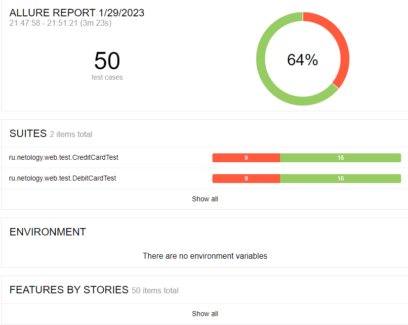

# Отчёт о проведённом тестировании
### Краткое описание
- Автоматизировано тестирование комплексного сервиса по покупке тура с возможностью оплаты 2 способами - дебетовой картой и с выдачей кредита по данным банковской карты.
### Количество тест-кейсов
Общее количество тест-кейсов - 50:
- Покупка с оплатой дебетовой картой - 25, из которых позитивных - 1, негативных - 24;
- Покупка с оплатой в кредит - 25, из которых позитивных - 1, негативных - 24.
### Процент успешных и неуспешных тест-кейсов
- Успешных тестов - 32 (64%);
- Неуспешных тестов - 18 (36%).

### Общие рекомендации
В процессе тестирования были выявлены 13 багов, на них заведены следующие [Issues](https://github.com/greyear/qa-diploma/issues).
Некоторые решения о заведении багов принимались на основе логики и собственного опыта тестировщика, при этом более правильным подходом, обеспечивающим качественный результат, стало бы тестирование на основе технической документации. Например, документации, описывающей ожидаемое поведение сервиса в зависимости от статуса карты, ожидаемые виды ошибок, в т.ч. моменты появления ошибок валидации полей, правила заполнения таблиц в БД, и т.д.